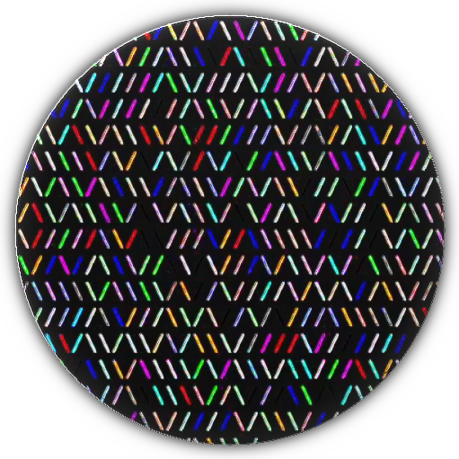
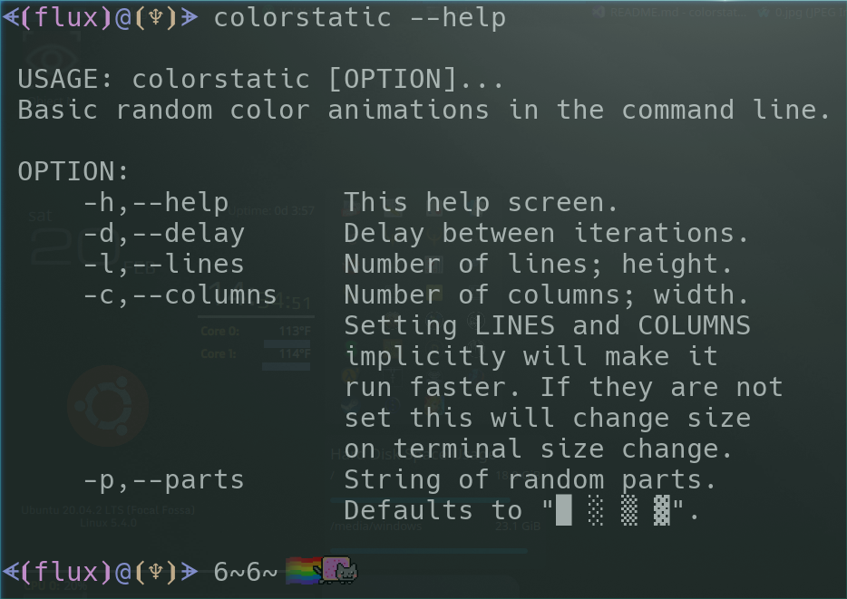
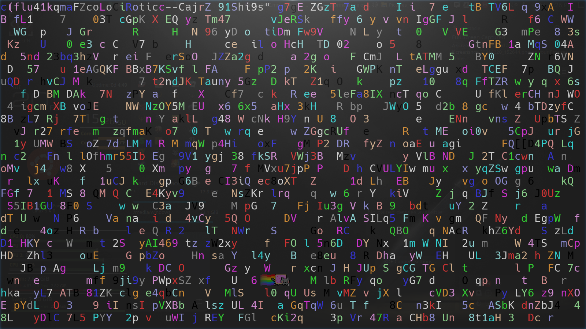
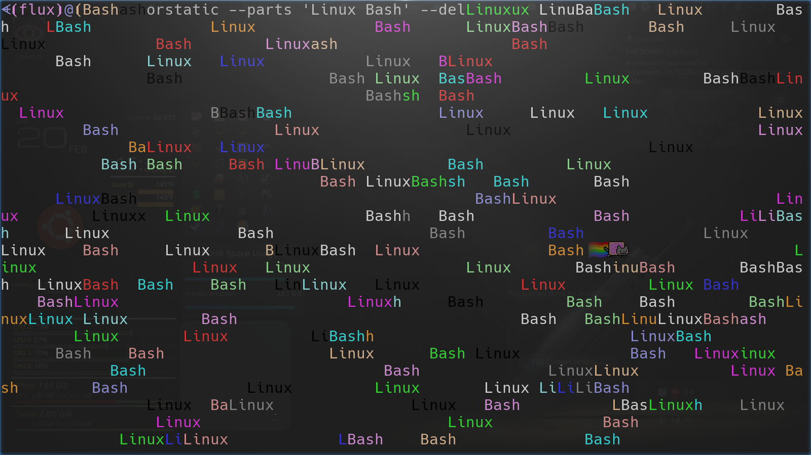

# Color Static (C++ Edition)

Random color animations by character frames for fun in the command line&#46;

[](docs/media/misc/colorstatic.png)

- [Color Static (C++ Edition)](#color-static-c-edition)
  - [Coming Soon](#coming-soon)
  - [About](#about)
    - [Description and information](#description-and-information)
    - [Motivation](#motivation)
    - [Disclaimer](#disclaimer)
    - [MD5 Information](#md5-information)
    - [Code Quality](#code-quality)
  - [Usage](#usage)
    - [Various Tips](#various-tips)
    - [Environment](#environment)
    - [Install or portable](#install-or-portable)
    - [Files](#files)
    - [Examples](#examples)
  - [Media](#media)
    - [Screenshots](#screenshots)
    - [YouTube Videos](#youtube-videos)
  - [LICENSE](#license)

<a href="https://twitter.com/intent/tweet?url=https://github.com/Lateralus138/colorstatic%0D%0A&text=%27ColorStatic%27+-+Fun+way+to+generate+random+colorful+%22Static%22+style+animations+in+a+%23Linux+command+line+via+%40thefluxapex%0D%0A%0A&name=medium&hashtags=programming,coding,fun,commandline" target="_blank"></a>

---

## Coming Soon

***NOTE***: This has been re-written in ***`C++`*** and will (possibly) be cross-platform for *Linux*, *Windows*, and *MacOS*, but coming to *Linux* first.

![Under Construction](https://img.shields.io/static/v1?logo=data:image/png;base64,iVBORw0KGgoAAAANSUhEUgAAAA4AAAAOCAYAAAAfSC3RAAACmElEQVQokUWSa0iTcRTGn//26u4b6ZQ0U8lKMqykwPpgZVBEHyLp8jEoIZJADCQ0iCiStIwuZmHRioIuroQss2VkrkIrdeFckiZqdhctTXPOve8Tr7M6X8/zO+fwPEfIwy7IwQA0GgExGYQwyhCmMLRX1z2hJCJSN+xZgqAZnPgCaAUQ0EHICjSYLlKBCDdNQb7HLmeRoy3zQFnzYk/1WTckGUIXCVD+Kw+BpAxtuBXCpkN7bdXt/JL3W3J3xuHg3iTsL/NkNFWVPoWkQOj/wxooCrRhFgiTjI4n9ZVHHQObjxVEY8UGIi1zEhVFCahwdq5qvn+hHkKC0EcBigxwvAnkW3ge7L6TMi+VztOLOOKOY8ulKL68GM2emnjeLF3AZSlz2FCZ6yaHwLGv6pkv8MyxsUoHLcsLwBuHwE0rtdy2UuLWNTpmpkkszQEfnAPDAd47tbaB7NaJR+eXujfmtGTUXgFWp5uwPd8Oi1GBJEmwWYlP34L4PSFw7chPeD+MYnkWUVmy0CeNfe5N8ANIjNWpNmHzqklYrDIGRwRm2gXsM/xofRMOf1AgcbYOAfgxMvgxCmS9+dbh5A6VarxuIMdBDoJ0g+vSreytNpAEux7qqWrK82I+kC2xYOAzyFbz5QNJPrXhdRo4XK/n3WILkxPsbKqwsr8xBB3PjukhGyJJv+qqB+QvkN0mR2Fim5pU1hobzxTYOPbcyJoTNpoAlu6wdZKvIslR0O9VXe0Clc5p2Ge4WDh36ux3ThM/1RqnNhXvilU32cjvINtAf4cKdkzlSHpBTqgNY11JfLtFA+o14NU8Wx/piggNfg2yGVR8EF9/dP37PyCIoDQLs8z9hmv71nsC4wFz9klX2tD4/AEG+gBoQ7KghD8MZ2xdnt7s7wAAAABJRU5ErkJggg==&label=Under&message=Construction&style=for-the-badge&color=b91d47&labelColor=1d1d1d)

<details>
  <summary>Current project status&#46;</summary>
  <p>This project is currently under construction and any files found here are unofficial and temporary&#46;&#46;&#46;<br>Having said that, the current build is as stable as I can tell and will be a <i>Release</i> build as soon as I finish this <a href="./README.md">README.md</a></p>
</details>

---

## About

### Description and information

Fun command line program to generate a random colorful &#34;Static&#34;/&#34;Matrix&#34; &#40;like&#63;&#41; style animation in a command line.

This is a ***C&#43;&#43;*** version of [the ***Bash*** version I wrote](https://github.com/Lateralus138/colorstatic-bash)&#46;

This is a first version and a vague idea&#44; I plan to completely re&#45;write this in a 2nd version&#46;

This program displays random color animations by character frames for some fun in the command line&#46; The default frames provided by the program&#44; especially at a low font size&#44; looks like old television static &#40;to me at least&#41;&#46;
 
There are several options and cool things you can do; change speed &#40;delay&#41;&#44; use all kinds of character frames&#44; marquee text&#44; change width &#40;COLUMNS&#41; and height &#40;LINES&#41; &#40;use width to do the math to adjust for strings in your frames so that your scroll&#45;back history doesn't extend too far&#46;

Screens of basic demo

<sub>Click to toggle screenshot previews&#58;</sub>

<details>
<summary>One frame scrolled &#40;zoomed&#41; out to tiny font&#46;</summary>

</details>

<details>
<summary>One frame scrolled &#40;zoomed&#41; out to small font&#46;</summary>

</details>

<details>
<summary>One frame scrolled &#40;zoomed&#41; out to small medium&#46;</summary>

</details>

### Motivation

Some time ago &#40;more than a few handfuls of years&#63;&#41; I ran across this `static` style loop example in a script and the another generic `matrix` &#40;with a little '`m`'&#41; style script and I have since been fascinated with fun, quirky, and geeky things in the command line; no matter how redundant and time wasting&#46; 

This was inspired by my [Bash script version](https://github.com/Lateralus138/colorstatic-bash) as I wanted to make it faster and more cross&#45;platform &#40;only cross terminal for now&#41; and so I thought I'd write it in *C&#43;&#43;*&#46;

### Disclaimer

I did not come up with this initial concept of looping this command; this is, of course, inherit in the `printf` command and only the creators can claim it and I'm really not sure who to give credit to; though I would gladly do so.

***IF YOU HAVE INFORMATION ON WHERE THE CONCEPT OF THIS ORIGINAL IDEA CAME FROM THEN PLEASE LET ME KNOW SO I CAN GIVE PROPER CREDIT, because I still can&#39;t remember where I originally seen it&#46;***

Please create an [issue here](https://github.com/Lateralus138/colorstatic/issues/new) and I will add an accreditation section&#46;

Having said that, 99.99% of the code and everything here is my creation. 

### MD5 Information

This information is generated in a *GitHub Action* immediately after the successful build of this project&#46;

<!-- ### Current Windows X86 MD5


### Current Windows X64 MD5

 -->


Current Linux MD5


Current Debian MD5


<!-- ### Current MacOs MD5


### Current Android 32 Bit MD5


### Current Android 64 Bit MD5

 -->

### Code Quality

|Name|Code Quality|
|:---:|:---:|
|colorstatic @ CodeFactor.io||

___

## Usage

### Various Tips

- Frames can be comma delimited lists of anything as long as your terminal can display your list&#59; from single characters to unicode strings&#46;
- If your frames are longer than single characters then it is a good idea to set the `--column` width to the size of the current terminal width&#58; `$COLUMNS` minus the width of your longest strings length in your frames list minus 1 &#40;sometimes&#41;&#44; so for example&#58; `colorstatic -f 'word,word2, , , ' --columns $((($COLUMNS - 5) - 1))` in *Bash* shell so that no words ever extend over the edge of screen to overextend the scroll&#45;back history way too far&#46;
- The more repeat instances of spaces &#40;or any other character or string for that matter&#41; in the *Frames* list will give a better likelyhood of seeing spaces &#40;or that character or string&#41;&#59; so `-f 'A, , , , ,  '` would make it 5 times more likely you&#39;d see a space rather than an &#39;A&#39;&#46;

### Environment

This is a command line tool for use in command lines in ***Linux*** for now&#44; but I plan to make it cross&#45;platform for ***Windows*** and ***MacOS*** as well in version 2&#46;

### Install or portable

This can be installed to `/usr/bin` with the `.deb` ***Debian*** package installer that also provides *Bash Completetion* for options&#47;switches and some hi&#45;color icons if for if you want to create a *.desktop* shortcut file&#46; I have also provided a portable executable pre&#45;compiled binary that you can place and run from anywhere you like&#46; You can also compile and install from the source folder &#40;linux&#41; with the provided ***make*** file with a very simple make command&#58; `make && sudo make install && sudo make clean` to build&#44; install&#44; and clean up the source folder.

### Files

All source packages&#44; `.deb` package installer&#44; and pre&#45;compiled binary can be found at the current ***[Release Page](https://github.com/Lateralus138/colorstatic/releases)***&#46;

### Examples

The examples are better viewed in my [YouTube](#youtube-videos) demonstrations since they are animated, but here's a few that shows what it will look like to type them out. This is a non&#45;exhaustive list&#46;

Basic Execution

Basic execution with all defaults. This method allows it to change character width and height upon terminal resizing.

```Shell
 $ colorstatic
```

Quarter Screen with a Delay

Set it to a quarter of the current terminal size and slow it down.

```Shell
 $ colorstatic --lines $((LINES/2)) --columns $((COLUMNS/2)) --delay 500
 # or
 $ colorstatic -l $((LINES/2)) -c $((COLUMNS/2)) -d 500
 # In a script you should use `$(tput lines)` and `$(tput cols)`
 # in place of LINES and COLUMNS
```

Using Alternative Characters

By default the displayed characters will be: `█,░,▒,▓, `, but you can use whatever string or array of characters you like as long as you can display them correctly in your terminal.

You can do this with the `-f,--frames` switch.

```Shell
 $ colorstatic --frames '\,/'
 # or create array of all decimal ints and lower and upper
 # case Latin based characters 
 $ chars="$(printf '%d,' {0..9};printf '%s,' {a..z} {A..Z})"
 $ colorstatic --frames "$chars"
```

Help Screen

```Shell
 $ colorstatic --help
                                                  
 USAGE: colorstatic [SWITCH [PARAMETER]...]...    
 'ColorStatic' - Random color animations by       
 character frames in the command line. Press      
 [Enter] or [Ctrl+C] to quit this program.        
                                                  
 SWITCH: optional                                 
     -h, --help    This HELP message.             
     -d, --delay   Delay between frames in        
                   milliseconds.                  
     -c, --columns Force number of columns.       
     -l, --lines   Force number of lines.         
     -f, --frames  A comma delimited string or    
                   array of characters to be used 
                   as random frames. Defaults to: 
                   ' ,█,░,▒,▓'                    
     -m, --mono    Monochrome mode, disable       
                   random colors.                 
                                                  
 PARAMETER:                                       
     Delay      Number in integer milliseconds.   
     Columns    Number in integers.               
     Lines      Number in integers.               
     Frames     String array of characters        
                delimited by a comma; e.g.:       
                ' ,#,@,^,*' or:                   
                "${BASH_ARRAY[@]}" etc...         
                                                  
 ERRORS:                                          
     1   Error in delay parameter.                
     2   Error in columns parameter.              
     3   Error in lines parameter.                
     4   Error in frames parameter.               
                                                  
```

Find video demonstrations with versions of these examples in the list of videos below in the `Media` section: [YouTube Videos](#youtube-videos).

---

## Media

### Screenshots

Help Screen



Main Static


Latin Based Chacters and digits.



Linux Bash



Tiny Font Size


Small Font Size


Medium Font Size


### YouTube Videos

Some of these are for the Bash version, but it's essentially the same thing just the new version is faster.

|Thumbnail|Link - Newest to Oldest|
|:---:|:---:|
||[https://www.youtube.com/watch?v=nB1RVuVL5CI](https://www.youtube.com/watch?v=nB1RVuVL5CI)|
||[https://youtu.be/GyNQpkrmv50](https://youtu.be/GyNQpkrmv50)|
||[https://youtu.be/-R8tEdHDCpE](https://youtu.be/-R8tEdHDCpE)|
||[https://youtu.be/jSZO-oy7xqI](https://youtu.be/jSZO-oy7xqI)|

---

## [LICENSE](./LICENSE)

****

<details>
  <summary>License Excerpt</summary>
  <br>
  <blockquote>
  This program is free software&#58; you can redistribute it and&#47;or modify it under the terms of the GNU General Public License as published by the Free Software Foundation&#44; either version 3 of the License&#44; or &#40;at your option&#41; any later version&#46;
  </blockquote>
  <br>
  <blockquote>
  This program is distributed in the hope that it will be useful&#44; but WITHOUT ANY WARRANTY&#59; without even the implied warranty of MERCHANTABILITY or FITNESS FOR A PARTICULAR PURPOSE&#46;  See the GNU General Public License for more details&#46;
  </blockquote>
</details>
<br>

---

If you like this project and care to donate to my PayPal:

[](https://paypal.me/ianapride?locale.x=en_US)